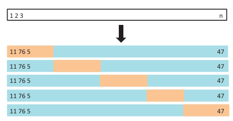

```{r setup, include=FALSE}
library(ggplot2)
library(magrittr)
library(tidyverse)
library(plot3D)
library(ISLR)
theme_set(theme_minimal(14))
options(htmltools.dir.version = FALSE)
```

# Conteúdo

- Cross-Validation

- Regressão Linear

- Regularização/LASSO

- Regressão Logística

- Matriz de Confusão

- Curva ROC

- F1

---

# Cross-validation (validação cruzada)

**Objetivo da Validação cruzada:** estimar melhor o erro de predição.

## Estratégia

.pull-left[

1) Dividir o banco de dados em K partes. (Por ex, K = 5 como na figura)

2) Ajustar o mesmo modelo K vezes, deixar sempre um pedaço de fora para servir de base de teste.

3) Teremos K valores de erros de teste. Tira-se a média dos erros.

]

.pull-right[

---------------------------------> linhas
]

---

## Validação Cruzada

```{r, eval = FALSE}
vfold_cv(cars, v = 5)
```

```{r, echo = FALSE}
library(rsample)
set.seed(1)
cars_cv <- rsample::vfold_cv(cars, v = 5) %>%
  mutate(
    n_treino = map_dbl(splits, ~nrow(as.data.frame(.x))),
    n_teste = map_dbl(splits, ~nrow(assessment(.x))),
    regressao = map(splits, ~lm(dist ~ speed, data = .x)),
    rmse_teste = map2_dbl(regressao, splits, ~ {
      df <- rsample::assessment(.y) %>%
        mutate(pred = predict(.x, newdata = rsample::assessment(.y)))
      
      round(sqrt(mean((df$dist - df$pred)^2)), 2)
    })
  )
cars_cv
```

ERRO DE VALIDAÇÃO CRUZADA: $$RMSE_{cv} = \sqrt{\frac{1}{10}\sum_{i=1}^{10}RMSE_{Fold_i}} = 15,01$$

---

# Cross-validation (validação cruzada)

Ir para o R


---

# Regressão Linear


.pull-left[

### Regressão Linear Simples

$$
y = \beta_0 + \beta_1x
$$

### Exemplo: 

$$
dist = \beta_0 + \beta_1speed
$$

]


.pull-right[

```{r,echo = FALSE, fig.height=4.5}
grafico_da_reta <- ggplot(cars, aes(x = speed, y = dist)) + 
  geom_point(size = 5)  +
  geom_smooth(se = FALSE, size = 3, method = "lm") +
  theme_minimal(24)+
  labs(
    title = " "
  ) 

grafico_da_reta
```

]

### No R:

```{r, eval = FALSE}
linear_reg() %>% 
  fit(dist ~ speed, data=cars)
```


.footnote[
Ver [ISL](https://www.ime.unicamp.br/~dias/Intoduction%20to%20Statistical%20Learning.pdf) página 61 (Simple Linear Regression).
]


---

# Regressão Linear


.pull-left[

### Regressão Linear Múltipla

$$
y = \beta_0 + \beta_1x_1 + \dots + \beta_px_p
$$

### Exemplo: 

$$
disp = \beta_0 + \beta_1wt + \beta_2mpg
$$

]

.pull-right[

```{r, fig.height=4, fig.align="center", fig.width=7, echo=FALSE}
# x, y, z variables
x <- mtcars$wt
y <- mtcars$disp
z <- mtcars$mpg
# Compute the linear regression (z = ax + by + d)
fit <- lm(z ~ x + y)
# predict values on regular xy grid
grid.lines = 26
x.pred <- seq(min(x), max(x), length.out = grid.lines)
y.pred <- seq(min(y), max(y), length.out = grid.lines)
xy <- expand.grid( x = x.pred, y = y.pred)
z.pred <- matrix(predict(fit, newdata = xy), 
                 nrow = grid.lines, ncol = grid.lines)
# fitted points for droplines to surface
fitpoints <- predict(fit)
# scatter plot with regression plane
scatter3D(x, y, z, pch = 18, cex = 2, 
          theta = 20, phi = 20, ticktype = "detailed",
          xlab = "wt", ylab = "disp", zlab = "mpg",  
          surf = list(x = x.pred, y = y.pred, z = z.pred,  
                      facets = NA, fit = fitpoints), colkey = FALSE)
```

]


### No R:

```{r, eval = FALSE}
linear_reg() %>% 
  fit(disp ~ wt + mpg, data=mtcars)
```

.footnote[
Fonte: [sthda.com/impressive-package-for-3d](http://www.sthda.com/english/wiki/impressive-package-for-3d-and-4d-graph-r-software-and-data-visualization)
]


---

# Regressão Linear - "Melhor Reta"

Queremos a reta que **erre menos**.

Uma medida de erro: RMSE

$$
RMSE = \sqrt{\frac{1}{N}\sum(y_i - \hat{y_i})^2}
$$

Ou seja, nosso é **encontrar os $\hat{\beta}'s$ que nos retorne o ~menor~ RMSE.**

#### IMPORTANTE! 

o RMSE é a nossa **Função de Custo** e pode ser diferente da **Métrica** que vimos nos slides anteriores!

- **Função de Custo** - para encontrar os melhores parâmetros.
- **Métrica** - para encontrar os melhores hiperparâmetros.

---

## Qual o valor ótimo para $\beta_0$ e $\beta_1$?

No nosso exemplo, a nossa **HIPÓTESE** é de que 

$$
dist = \beta_0 + \beta_1speed
$$

Então podemos escrever o RMSE

$$
RMSE = \sqrt{\frac{1}{N}\sum(y_i - \hat{y_i})^2} = \sqrt{\frac{1}{N}\sum(y_i -  \color{red}{(\hat{\beta}_0 + \hat{\beta}_1speed)})^2} 
$$

Com ajuda do Cálculo é possível mostrar que os valores ótimos para $\beta_0$ e $\beta_1$ são

$\hat{\beta}_1 = \frac{\sum(x_i - \bar{x})(y_i - \bar{y})}{\sum(x_i - \bar{x})^2}$

$\hat{\beta}_0 = \bar{y} - \hat{\beta}_1\bar{x}$

OBS: Já que vieram do EQM, eles são chamados de **Estimadores de Mínimos Quadrados**.


---

## Regressão linear

No R

## Regularização - LASSO

Relembrando o nossa **função de custo** RMSE.

$$RMSE = \sqrt{\frac{1}{N}\sum(y_i - \hat{y_i})^2} = \sqrt{\frac{1}{N}\sum(y_i -  \color{red}{(\hat{\beta}_0 + \hat{\beta}_1x_{1i} + \dots + \hat{\beta}_px_{pi})})^2}$$

Regularizar é "não deixar os $\beta's$ soltos demais".

$$RMSE_{regularizado} = RMSE + \color{red}{\lambda}\sum_{j = 1}^{p}|\beta_j|$$

Ou seja, **penalizamos** a função de custo se os $\beta's$ forem muito grandes.

**PS1:** O $\color{red}{\lambda}$ é um hiperparâmetro para a Regressão Linear.

**PS2:** Quanto maior o $\color{red}{\lambda}$, mais penalizamos os $\beta's$ por serem grandes.

.footnote[
Ver [ISL](https://www.ime.unicamp.br/~dias/Intoduction%20to%20Statistical%20Learning.pdf) página 203 (Linear Model Selection and Regularization).
]


---

## Regularização - LASSO

Conforme aumentamos o $\color{red}{\lambda}$, forçamos os $\beta's$ a serem cada vez menores.


.footnote[
Ver [ISL](https://www.ime.unicamp.br/~dias/Intoduction%20to%20Statistical%20Learning.pdf) página 219 (The LASSO).
]

---

## Regularização - LASSO

Existe um $\color{red}{\lambda}$ que retorna o menor erro de cross-validation.


.footnote[
Ver [ISL](https://www.ime.unicamp.br/~dias/Intoduction%20to%20Statistical%20Learning.pdf) página 219 (The LASSO).
]


---

## Regularização - LASSO

Ir para o R


---
class: inverse, center, middle

# CLASSIFICAÇÃO

---

# Regressão Logística


.pull-left[

### Para  $Y \in {0, 1}$ (binário)

$$
log\left\(\frac{p}{1-p}\right\) = \beta_0 + \beta_1x
$$

em que $p = P(Y = 1|x)$.

Lembrete: No caso de 
]


.pull-right[

```{r,echo = FALSE, fig.height=4.5}
grafico_da_reta <- ggplot(cars, aes(x = speed, y = dist)) + 
  geom_point(size = 5)  +
  geom_smooth(se = FALSE, size = 3, method = "lm") +
  theme_minimal(24)+
  labs(
    title = " "
  ) 

grafico_da_reta
```

]

### No R:

```{r, eval = FALSE}
logistic_reg() %>% 
  fit(dist ~ speed, data=Default)
```


.footnote[
Ver [ISL](https://www.ime.unicamp.br/~dias/Intoduction%20to%20Statistical%20Learning.pdf) página 131 (Logistic Regression).
]


---

# Matriz de Confusão


---

# Curva ROC

---

# Outras Métricas

## F1


