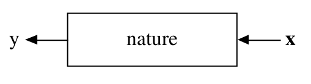

```{r setup, include=FALSE}
options(htmltools.dir.version = FALSE)
```

## Sobre nós

</img>

---

# Programa do curso

- Introdução ao Machine Learning

- Regressão linear

- Regressão logística, regressão vs classificação

- Estratégias gerais: separação da base de dados, reamostragem, tuning de modelos, métricas de performance

- Regularização

- Modelos de árvores

- Bagging e Boosting

---

# Ciência de dados


---

# Referências

.pull-left[
<a href = "https://r4ds.had.co.nz/">
</img>
</a>
]

.pull-right[
<a href = "http://www-bcf.usc.edu/~gareth/ISL/">
</img>
</a>
]

---

class: middle, center, inverse

# Introdução

---

# O que é Machine Learning?

<br>

--

- Não é um termo novo: criado por Arthur Samuel, em 1959


- Machine Learning é um nome para modelagem preditiva

- Modelagem preditiva é uma abordagem de análise de dados que visa gerar a estimativa mais precisa possível para uma quantidade ou fenômeno (Max Kuhn, 2014).


---

# Por que a febre?

- Poderio computacional

- Disponibilidade de dados

- Sucesso em resolver problemas historicamente difíceis

---

## Exemplos


--


--


--


--


--


---

class: middle, center

# Relação com a Estatística

Leo Breiman: ["Statistical Modeling: The Two Cultures"](https://projecteuclid.org/euclid.ss/1009213726)


---
class: center, middle




1) Gostaríamos de saber como $x$ e $y$ estão relacionadas.


2) Gostaríamos de prever $y$ a partir de $x$.


<br>

Matematicamente, queremos encontrar uma função $f()$ tal que:

$$
y \approx f(x)
$$

---
class: center, middle

  
 
--

<br>
<br>
 


---
class: center, middle

</img>

---
class: center, middle


---

# Pensamento crítico

<br>
<br>
<br>

- Entender o problema

- Entender o objetivo

- Entender a métrica


---
class: center, middle


---
class: center, middle


---

# Exemplo


```{r echo=FALSE, include=FALSE}
knitr::opts_chunk$set(
  echo = FALSE, 
  message = FALSE, 
  warning = FALSE,
  fig.width=6, 
  fig.height=6,
  fig.align='center'
)
library(tidyverse)
adv <- read_csv("data/Advertising.csv")
```

Somos consultores e fomos contratados para dar conselhos para uma empresa aumentar as suas vendas.

--

Obtivemos o seguinte banco de dados

```{r, fig.width = 10, fig.height = 4}
adv %>% 
  gather(midia, investimento, -sales) %>% 
  ggplot(aes(x = investimento, y = sales)) + 
  geom_point() +
  facet_wrap(~midia, scales = "free")
```

* O propritário não consegue interferir diretamente nas vendas, mas consegue interferir no investimento em propaganda. 

---

# Definições

- **X1**: budget para propagandas em jornal
- **X2**: budget para propagandas em radio
- **X3**: budget para propagandas em TV

* __Y__: qtd vendida

--

* __X1, X2 e X3__ são as variáveis explicativas, independentes, *features* ou preditores.

* Y é a variável resposta ou variável dependente. 

---

# Intuição

Queremos encontrar $f$ tal que

$$ Y \approx f(X) $$
ou

$$Y = f(X) + \epsilon$$

* $X = (X_1, X_2, ..., X_n)$
* $\epsilon$ é chamado de erro aleatório. Esse termo representa toda a variabilidade de $Y$ não explicada pelos preditores em $X$.

--

Machine Learning se refere a um conjunto de técnicas para obter estimativas o mais precisas possível da função $f$. 

---

# Intuição

A linha azul é o gráfico de uma  $f$ ajustada.

```{r, fig.width = 10, fig.height = 4}
adv %>% 
  gather(midia, investimento, -sales) %>% 
  ggplot(aes(x = investimento, y = sales)) + 
  geom_point() +
  geom_smooth() +
  facet_wrap(~midia, scales = "free")
```


---

# Por que estimar f?

--
* Predição

* Inferência


Em muitas situações X está disponível facilmente mas, Y não é fácil de descobrir. (Ou mesmo não é possível descobrí-lo).

$$\hat{Y} = \hat{f}(X)$$
fornece tanto uma relação entre X e Y quanto uma boa estimativa de Y.

---

## Inferência

Em inferência estamos mais interessados em entender a relação entre as variáveis explciativas $X$ e a variável resposta $Y$.

Por exemplo:

* Quais são as variáveis que estão mais relacionadas com a respostas?
* Qual a relação entre a resposta e cada um dos preditores?

---

## Predição

Neste caso não estamos interessados em como é a estrutura $\hat{f}$ desde que ela apresente predições boas para $Y$.
A acurácia de uma estimativa $\hat{Y}$ pode ser dividade em duas quantidades:

* erro redutível
* erro irredutível

</img>

* Essa parte irredutível, significa não redutível pela escolha do modelo/algoritmo. Ela pode ser reduzida se forem coletadas outras variáveis, mais dados etc.

--

Neste curso, vamos falar principalmente sobre **predição**.


---

# Regressão Linear

Vamos ao R!


