```{r setup, include=FALSE}
library(ggplot2)
library(magrittr)
library(knitr)
library(kableExtra)
library(tidymodels)
library(tidyverse)
library(plot3D)
library(ISLR)
theme_set(theme_minimal(14))
options(htmltools.dir.version = FALSE, fig.retina = 2)
```


# Conteúdo

- Árvores de decisão

- Random Forest

- Gradient Boost/XGboost

---

class: sem-padding

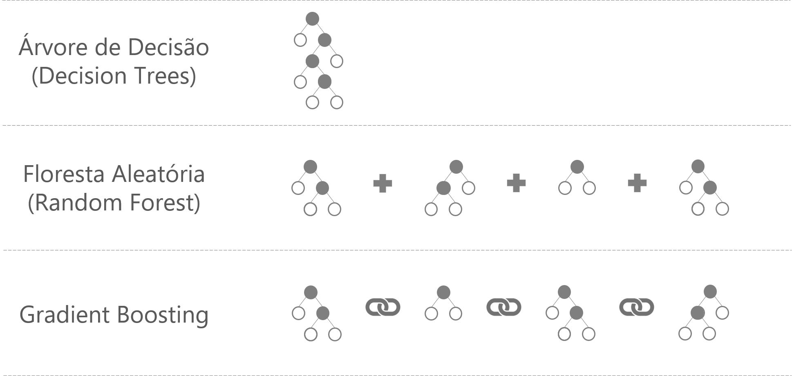

---

# No R

.pull-left[

```{r, eval=FALSE}
# árvore de decisão
modelo_tree <- decision_tree(
  min_n = tune(),
  tree_depth = tune(),
  cost_complexity = tune() 
)
```

```{r, eval=FALSE}
# Random Forest
modelo_rf <- rand_forest(
  min_n = tune(),
  mtry = tune(),
  trees = tune()
)
```

]

.pull-right[


```{r, eval=FALSE}
# XGBoost
modelo_xgb <- boost_tree(
  min_n = tune(),
  mtry = tune(),
  trees = tune(),
  tree_depth = tune(),
  learn_rate = tune(),
  loss_reduction = tune(),
  sample_size = tune() 
)
```


]

---


# Referências

.pull-left[
<a href = "https://web.stanford.edu/~hastie/Papers/ESLII.pdf">
</img>
</a>
]

.pull-right[
<a href = "http://faculty.marshall.usc.edu/gareth-james/ISL/ISLR%20Seventh%20Printing.pdf">
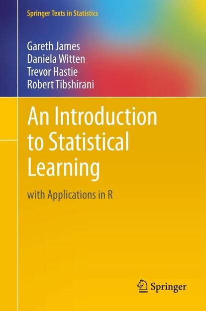</img>
</a>
]

---

class: inverse, center, middle

# Árvore de Decisão

---

# Árvore de Decisão

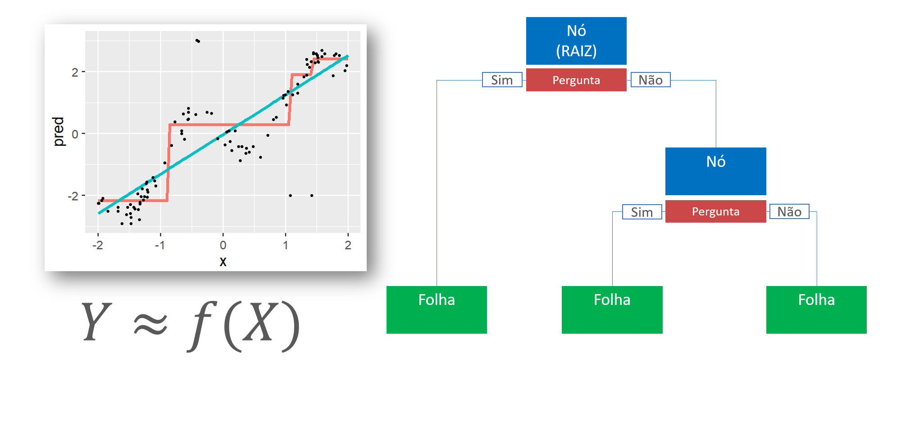

---

# Árvore de Decisão

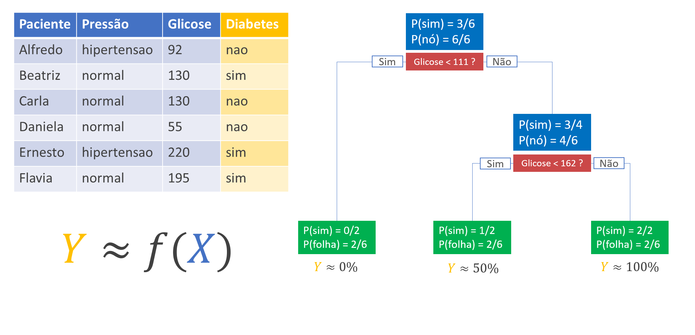

---

# Árvore de Decisão

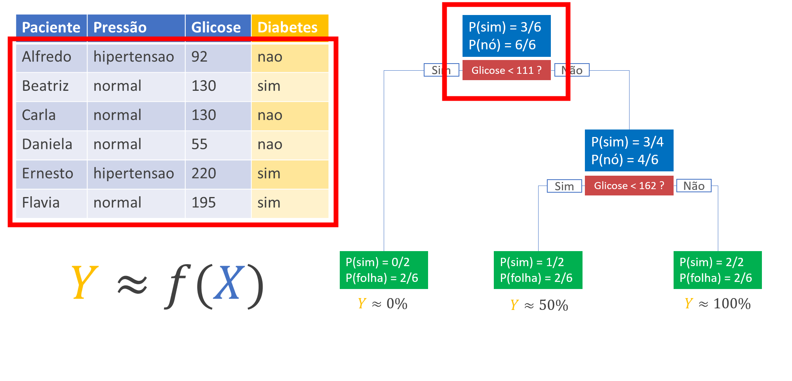

---

# Árvore de Decisão

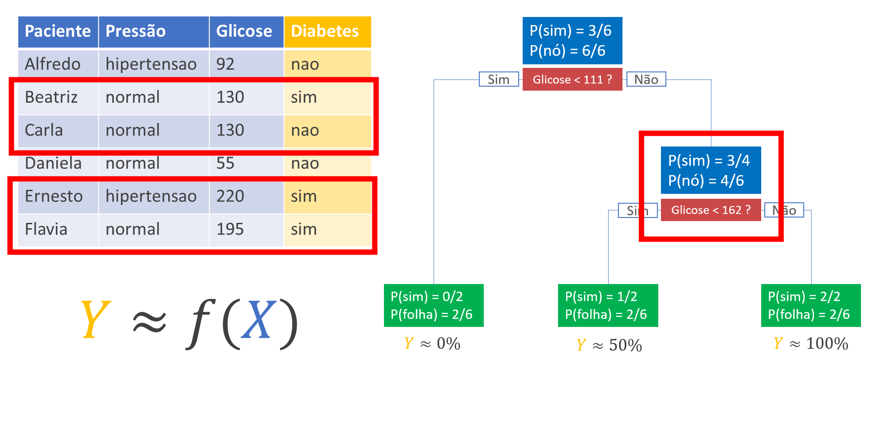

---

# Árvore de Decisão

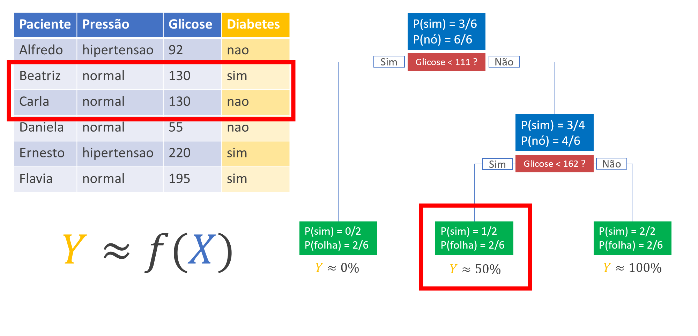

---

# Árvore de Decisão

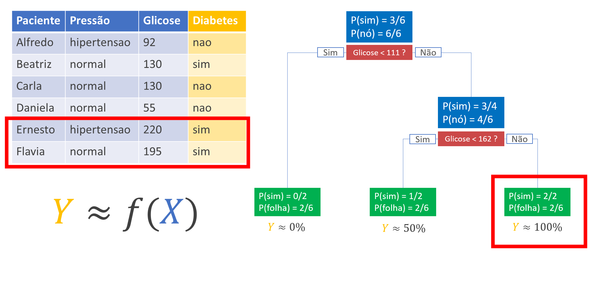

---

# Árvore de Decisão

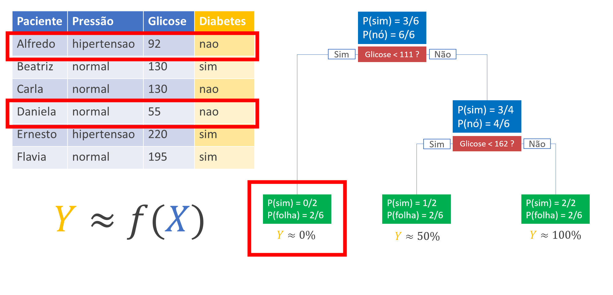

---

# Árvore de Decisão - Perguntas

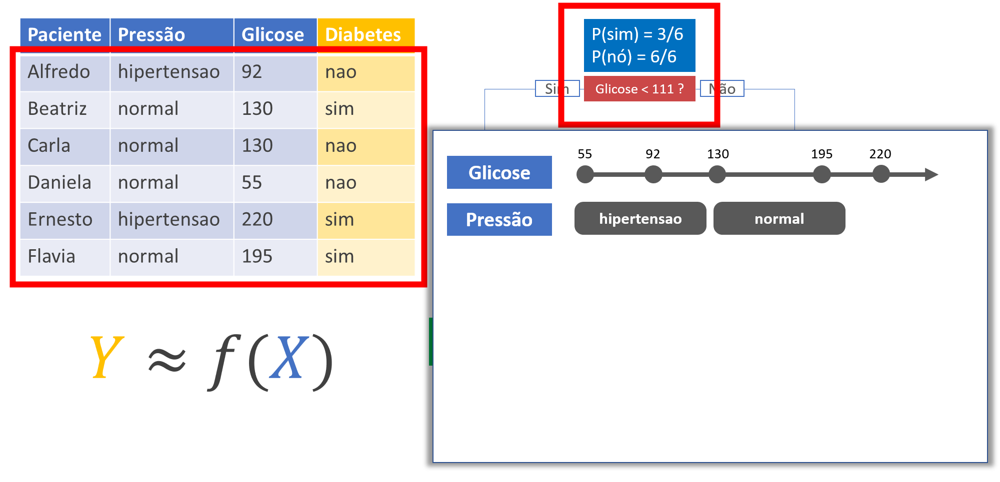

---

# Árvore de Decisão - Perguntas

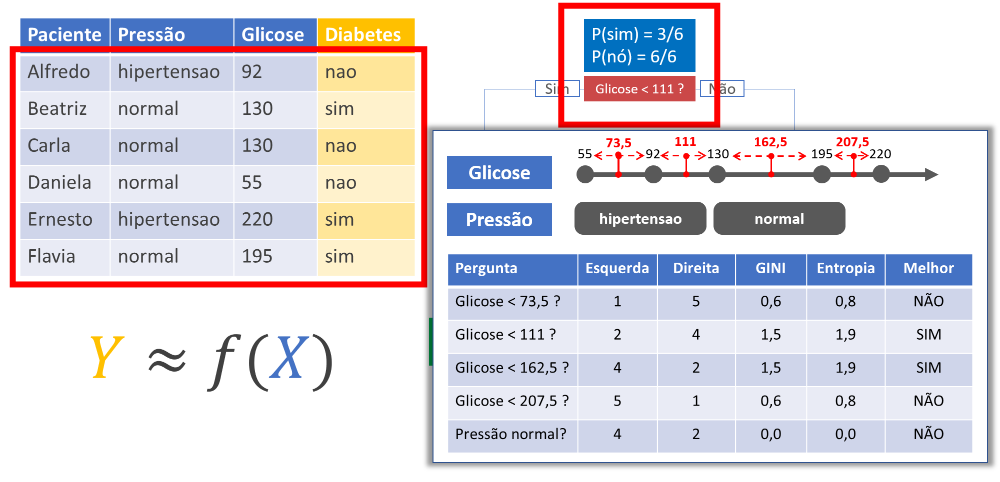

---

# Árvore de Decisão - Impureza e Ganho de Informação

### Ganho de Informação (information gain)

$$
\mbox{GI} = N . Imp(nó) - N(esq) . Imp(esq) - N(dir) . Imp(dir)
$$

### Medidas de Impureza mais comuns

.center[

]

.footnote[
Fonte: [spark.apache.org/docs/1.3.0/mllib-decision-tree.html]()
]


---

# Árvore de Decisão - Impureza e Ganho de Informação

### Exemplo usando o GINI


.center[

]


---

# Árvore de Decisão - Hiperparâmetros e Overfitting

.pull-left[

**min_n** - Quantidade mínima de observações dentro de um nó para se considerar dividir em duas folhas novas. Quanto menor, maior risco de overfitting.

.cinza[**tree_depth** - Profundidade: quanto mais profunda a árvore for, maior risco de overfitting.]

.cinza[**cost_complexity** - Parâmetro de complexidade: limite mínimo de ganho de informação que a divisão tem que fornecer para concretizar a criação das folhas.]

]


.pull-right[

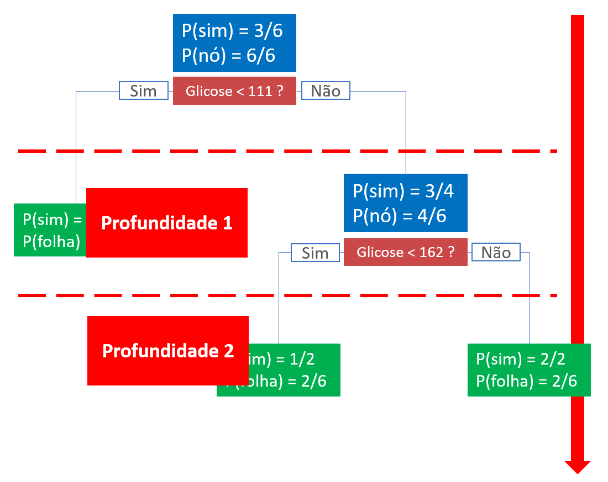

]


---

# Árvore de Decisão - Hiperparâmetros e Overfitting

.pull-left[

.cinza[**min_n** - Quantidade mínima de observações dentro de um nó para se considerar dividir em duas folhas novas. Quanto menor, maior risco de overfitting.]

**tree_depth** - Profundidade: quanto mais profunda a árvore for, maior risco de overfitting.

.cinza[**cost_complexity** - Parâmetro de complexidade: limite mínimo de ganho de informação que a divisão tem que fornecer para concretizar a criação das folhas.]

]


.pull-right[

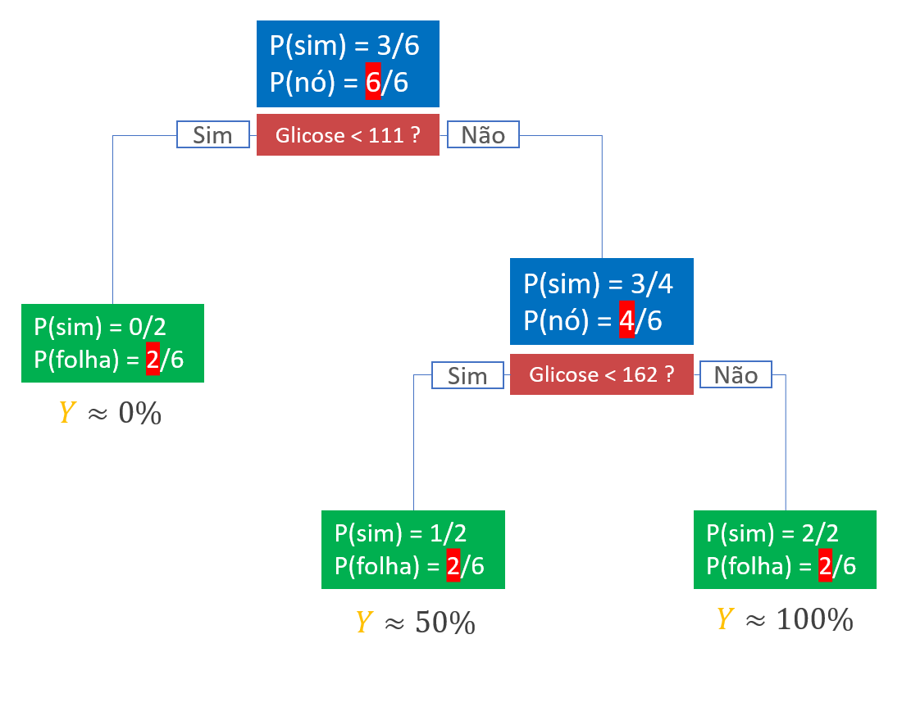

]


---

# Árvore de Decisão - Hiperparâmetros e Overfitting

.pull-left[

.cinza[**min_n** - Quantidade mínima de observações dentro de um nó para se considerar dividir em duas folhas novas. Quanto menor, maior risco de overfitting.]

.cinza[**tree_depth** - Profundidade: quanto mais profunda a árvore for, maior risco de overfitting.]

**cost_complexity** - Parâmetro de complexidade: limite mínimo de ganho de informação que a divisão tem que fornecer para concretizar a criação das folhas.

]


.pull-right[

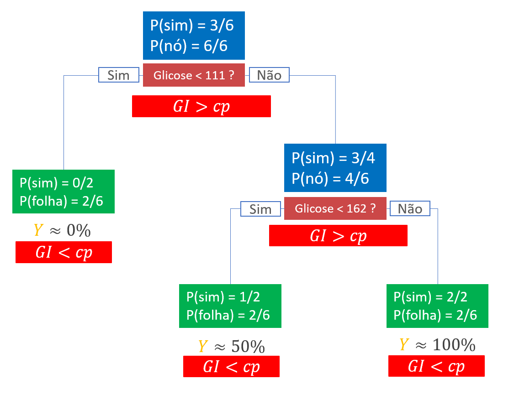

]

---

# Árvore de Decisão - Cost Complexity 


---

# Árvore de Decisão

.pull-left[

- O exemplo foi dado com variável resposta (diabetes) de apenas duas classes, SIM e NÃO, mas poderia ter três ou mais. 

- A variável explicativa hipertensão apresentava apenas duas classes também, mas poderia apresentar mais. Nesse caso, os algoritmos de árvores têm de decidir como fazer as PERGUNTAS. Esse [link da Freakonometrics](https://freakonometrics.hypotheses.org/20736) apresenta a heurística mais utilizada nesse caso.

- As figuras são representações diferentes para um mesmo modelo de árvore. As regiões $R_1, R_2, \dots$ correspondem às folhas da árvore.

]

.pull-right[
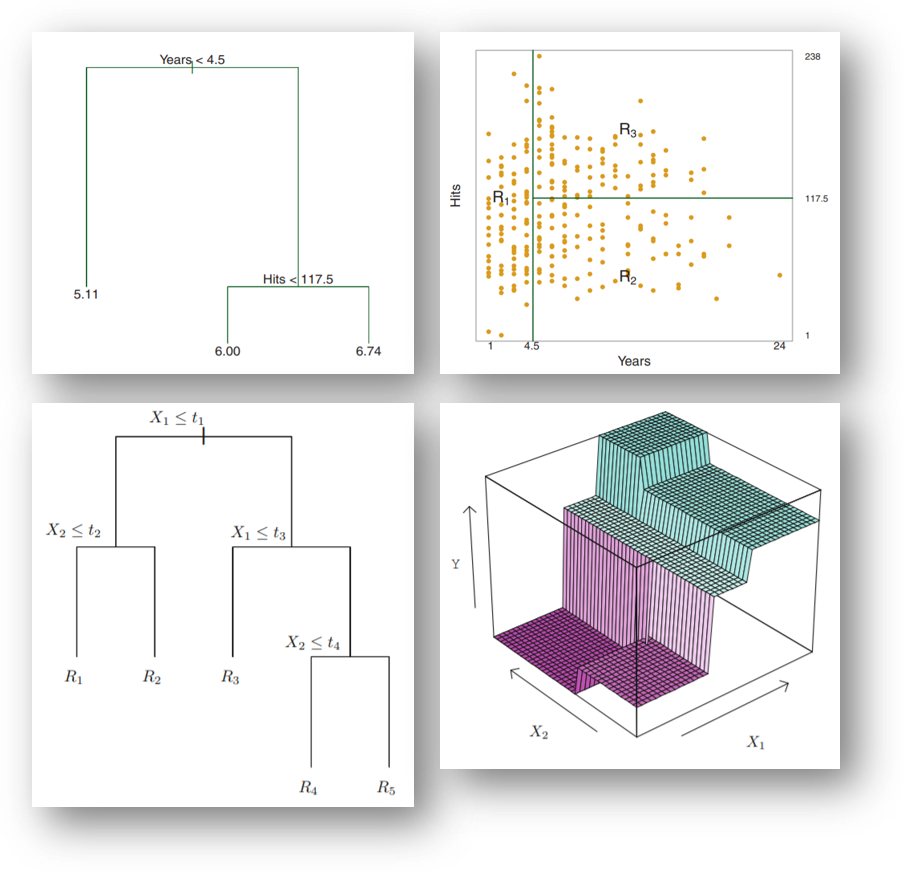

]


.footnote[
Ver [ISL](https://www.ime.unicamp.br/~dias/Intoduction%20to%20Statistical%20Learning.pdf) página 305 (Tree-based Methods).
]

---

class: inverse, center, middle

# Random Forest


---

# Relação Viés-Variância (Bias-variance tradeoff)

.pull-left[

$$
\mbox{E}[(Y - \hat{f}(x_o))^2]  =\\\\

\mbox{E}[(f(x_o) +\epsilon - \hat{f}(x_o))^2] = \\\\

(\mbox{E}\hat{f}(x_o) - f(x_o))^2 + \mbox{E}[(\hat{f}(x_o) - \mbox{E}\hat{f}(x_o))^2] + Var(\epsilon)  = \\

Viés^2 + Variância + Erro\ Irredutível

$$

]


.pull-right[
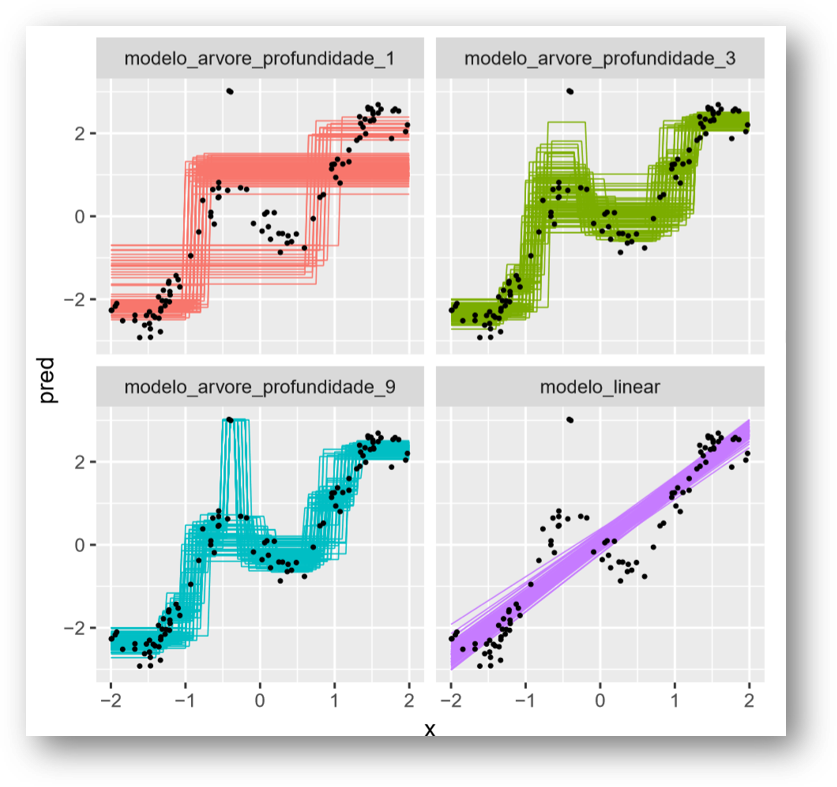

]


.footnote[
Ver [ISL](https://www.ime.unicamp.br/~dias/Intoduction%20to%20Statistical%20Learning.pdf) página 33 (The Bias-Variance Trade-Off).
]


---

# Relação Viés-Variância (Bias-variance tradeoff)

.pull-left[

$$
\mbox{E}[(Y - \hat{f}(x_o))^2]  =\\\\

\mbox{E}[(f(x_o) +\epsilon - \hat{f}(x_o))^2] = \\\\

(\mbox{E}\hat{f}(x_o) - f(x_o))^2 + \mbox{E}[(\hat{f}(x_o) - \mbox{E}\hat{f}(x_o))^2] + Var(\epsilon)  = \\

Viés^2 + Variância + Erro\ Irredutível

$$

]


.pull-right[
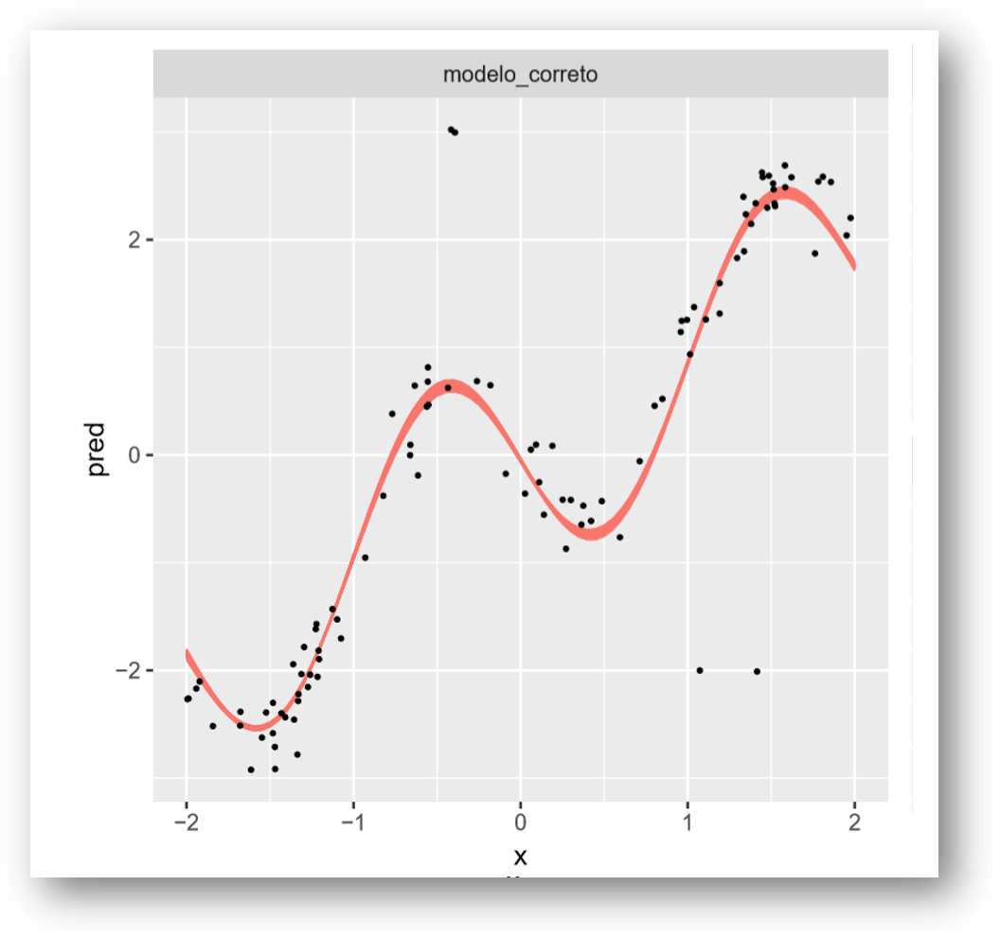

]


.footnote[
Ver [ISL](https://www.ime.unicamp.br/~dias/Intoduction%20to%20Statistical%20Learning.pdf) página 33 (The Bias-Variance Trade-Off).
]

---

# Random Forest

.pull-left-maior[

- **Random Forest** é a combinação de “palpites” de um monte de árvores de decisão. É um algoritmo de uma classe especial de ENSEMBLE: BAGGING.
- **ENSEMBLE**: mistura de 2 ou mais modelos. ([ESL](https://web.stanford.edu/~hastie/Papers/ESLII.pdf) p 605)
- **BAGGING**: Bootstrap AGGregation. ([ESL](https://web.stanford.edu/~hastie/Papers/ESLII.pdf) p 282) 
- Diferença para os **BAGGINGs**: Sorteia as colunas também.

#### Algoritmo

1. Sorteie **B** conjuntos de observações da base **D**
2. Para cada conjunto $b$ de **B**, sorteie $m$ variáveis de **D**
3. Para cada uma das **B** sub-bases geradas por $(b, m)$ construa uma árvore de decisão
4. Para previsão final, agregue as previsões individuais de cada uma das **B** árvore.

]

.pull-right-menor[
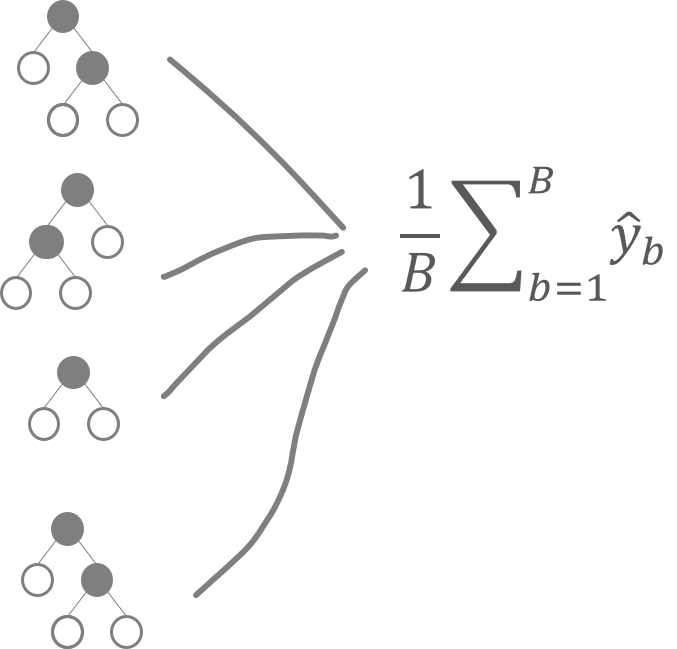


]

---

# Random Forest - Hiperparâmetros e Overfitting

.pull-left[

**min_n** – Qtd mínima de observações no nó para poder dividir.

**mtry** – Quantidade de variáveis (colunas) sorteadas por árvore. Tem que testar via cross-validation, pois é afetado pela razão entre variáveis boas e ruído.

**trees** – Número de árvores (amostras bootstrap) para treinar. Não afeta muito o overfitting.

]

.pull-right[


]

**PS:** random forest não usa CP. Ele permite que as árvores cresçam indeterminadamente, condicionadas apenas pelo **min_n**.

.footnote[
Ver [ISL](https://www.ime.unicamp.br/~dias/Intoduction%20to%20Statistical%20Learning.pdf) página 319 (Random Forest).
]

---

class: inverse, middle, center

# Gradient Boosting


---

# Gradient Boosting

- *Boosting* também é a combinação de “palpites” de um monte de árvores de decisão.

- Porém, não existe amostras *bootstrap* dentro do algoritmo, as árvores são construídas sequencialmente (cada árvore é construída usando informação da árvore passada).

**Forward Stagewise Algorithm (coração do gradient boost)**

.pull-left[

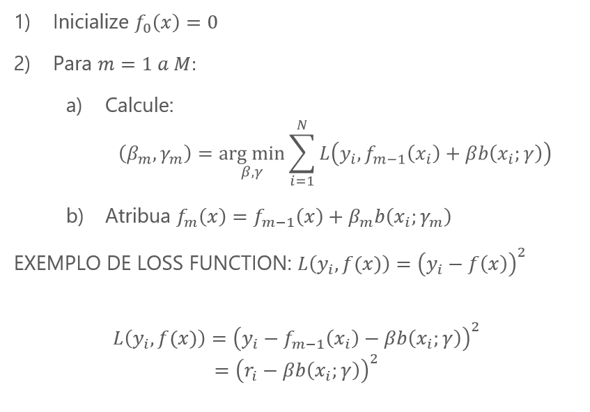

]

.pull-right[

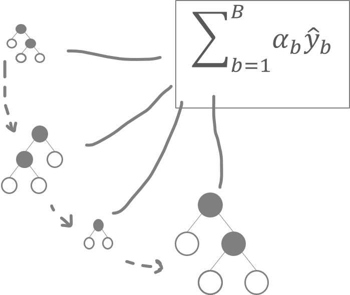

]

.footnote[
Ver [ESL](https://web.stanford.edu/~hastie/Papers/ESLII.pdf) página 341 (Gradient Boosting).
]


---

# Gradient Boosting

- *Boosting* também é a combinação de “palpites” de um monte de árvores de decisão.

- Porém, não existe amostras *bootstrap* dentro do algoritmo, as árvores são construídas sequencialmente (cada árvore é construída usando informação da árvore passada).

**Adaboost (versão para classificação binária)**
.pull-left[

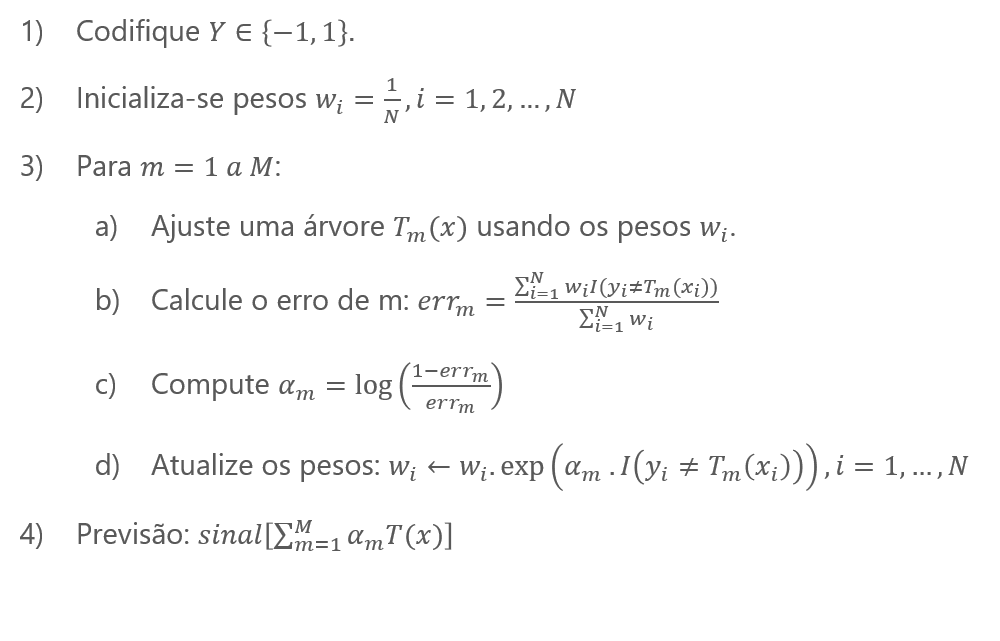

]

.pull-right[


]

.footnote[
Ver [ESL](https://web.stanford.edu/~hastie/Papers/ESLII.pdf) página 341 (Gradient Boosting).
]

---

class: inverse, middle, center

# XGBoost

---

#XGBoost

